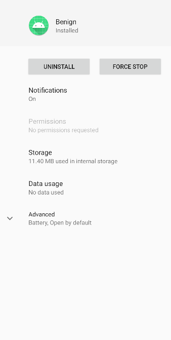
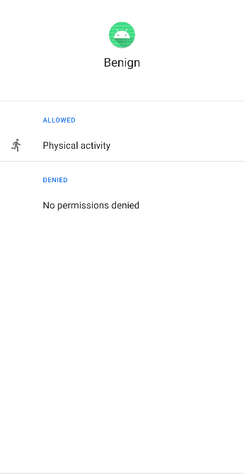

# **Custom-permission-elevating**

Creating a custom permission with a name signature similar to system permission can lead to permission elevation on future android version.

## To know before reading
  - A **custom permission** in Android is a developer-defined access control mechanism regulating specific app functionalities or components.
  - Android permissions have names that follow a certain format : **android.permission._(permission name)_**

## Exploitation Scenario

Consider a benign application called **benign** created before Android API 29 (Android 10). This application requests a custom permission named "android.permission.ACTIVITY_RECOGNITION" with a normal protection level.

Upon installation, the user is prompted with an application that shows him his current step counts.

Later, the device is updated by the user to a more recent android version (Android 10).

However, after updating his device, an unexpected issue arises. A new dangerous permission named "Physical Activity" ("android.permission.ACTIVITY_RECOGNITION") is granted without the user knowing about it.

As a result, this scenario exemplifies a privilege escalation case where the app gains access to potentially sensitive permission without the user's explicit authorization, presenting a security concern.

## API Levels

Tested on API Levels: 28-29

## Running Scenario

- Build & Run **benign** app on an device with Android 28.
    
    
    
- **benign** app has no permission at installation.
    
    
        
- Update and reboot your device to Android 10.

- Open the **benign** app.

    

- The Physical Activity permission has been granted to the **benign** app without requesting the user's consent.
    
    

## Recommendations

  - To ensure the successful execution of the attack scenario, use one of the specified API levels mentioned above.
  - You can execute the apps by building the open-source project using an IDE plugin (such as Android Studio) or by direcrtly utilizing the APK files found in the 'apks' folder.

## References

[1]. https://sites.google.com/view/custom-permission

[2]. https://www.geeksforgeeks.org/how-to-build-a-step-counting-application-in-android-studio
