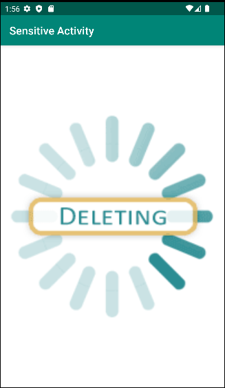
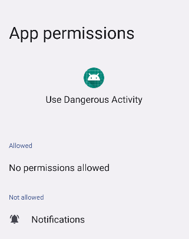
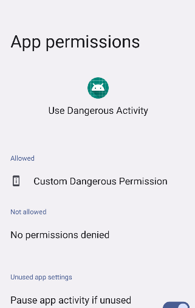

# Dangling Custom-Permission

The use of custom permission with a normal or signature protection level could lead to privilege escalation attack.

## Exploitation Scenario
Suppose there is a benign application named **benignv1** that includes a sensitive activity called **SensitiveActivity.java**. 
This activity enables users to input sensitive information into the content provider. However, due to an oversight, this
activity is initially protected with "**Normal**" permissions, which correspond to a weak protection level, despite its sensitive
functionality. After installing the **benignv1** application, **benignConsumer** becomes one of the installed applications and 
attempts to access the ****SensitiveActivity.java** of benignv1** for writing data, even though it lacks the required permissions.
In response to this security issue, the developer makes updates to enhance the security of the sensitive activity by applying
a dangerous protection level. This leads to the creation of a new application, **benignv2**, which is now secure. However, even
after installing **benignv2**, **benignConsumer** still attempts to write data without user consent, which represents a privilege
escalation case.

## API Levels
Tested on API Levels: 23 .. 29

## Running Scenario
- Build & Run **benignv1** app

  

- Build & Run **benignConsumer** app

  

- When the user click to the button, the app will have no restriction to access sensitive activity
  
  
- **beningConsumer** app has no permission granted, which is normal because the permission required has "normal" protection level.
  
  

- Build & Run **benignv2** app which upade the protection level of the required permission to dangerous

- Build & Run **benignConsumer** you will notice that benignConsumer app has an access to the **benignv1** sentisitive activity without the user constent, which a privilege escalation case.

  

## References
[1]. https://cve.mitre.org/cgi-bin/cvename.cgi?name=CVE-2021-0307

[2]. Li, R., Diao, W., Li, Z., Du, J., & Guo, S. (2021, May). Android custom permissions demystified: From privilege escalation to design shortcomings. In 2021 IEEE Symposium on Security and Privacy (SP) (pp. 70-86). IEEE

   
