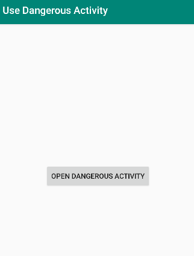
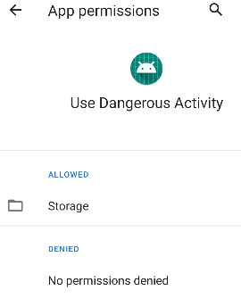

# Dangling Custom-Permission

The use of custom permission with a **normal** or **signature** protection level could lead to privilege escalation attack.

## To know before reading
  - A **custom permission** in Android is a developer-defined access control mechanism regulating specific app functionalities or components.
  - **Normal** and **Signature**  protection levels enable access to designated resources without requiring explicit user consent at install-time.
  - The granting of dangerous permissions is group-based in Android, .i.e. when an app requests a permission that belongs to a dangerous group, the user is prompted to grant the entire permission group rather than individual permissions within that group.

## Exploitation Scenario

Consider an Android application named **vulnerable** that includes a sensitive activity called **SensitiveActivity.java**. This activity enables users to input sensitive information into the content provider. However, due to an oversight, this activity is initially protected with a "**Normal**" or "**Signature**" custom permission, which correspond to a weak protection level, despite its
sensitive functionality.

After installing the **vulnerable** application, **vulnerable-consumer** app becomes one of the installed applications and attempts to access the ****SensitiveActivity.java** of vulnerable** app for writing data. This access is possible without proper security checks or restrictions due to the normal protection level assigned to the corresponding permission.

To exploit this security vulnerability, the attacker updates the **vulnerable** app by elevating the protection level to **dangerous** level. Additionally, they assign this permission to the *storage** permission group. This alteration results in the creation of a new application, **malicious**.

By replacing the **vulnerable** with the **malicious** app, the **vulnerable-consumer** app remains capable of writing data without user consent. Furthermore, it retains unnecessary and excessive permissions, rendering it overprivileged.

The **malicious** app, having replaced the **vulnerable** app, gains the ability to intercept sensitive data transmitted by 'vulnerable-consumer.' Moreover, due to the elevated and unnecessary permissions inherited from the 'vulnerable' app, the 'malicious' app can execute malicious actions, thus presenting a severe case of privilege escalation.

## API Levels: 

The dangling custom permission vulnerability has been successfully exploited in Android versions ranging from API level 23 to 29

## Running Scenario

- Build & Run **vulnerable** app

  

- Build & Run **vulnerable-consumer** app

  

- When the user click to the button, the app will have no restriction to access sensitive activity

  

- **vulnerable-consumer** app has no permission granted, which is normal because the permission required has "normal" protection level.

  

- Uninstall **vulnerable" app from the device. 

- Build & Run **malicious** app which upades the protection level of the required permission to dangerous and makes it into a "storage" permission-group

- Open **vulnerable-consumer** app again and  you will notice that benignConsumer app has an access to the sentisitive activity without the user constent, which a privilege escalation case.

  

## Recommendations

  - To ensure the successful execution of the attack scenario, use one of the specified API levels mentioned above.
  - You can execute the apps by building the open-source project using an IDE plugin (such as Android Studio) or by direcrtly utilizing the APK files found in the 'apks' folder.

## References

[1]. https://cve.mitre.org/cgi-bin/cvename.cgi?name=CVE-2021-0307

[2]. Li, R., Diao, W., Li, Z., Du, J., & Guo, S. (2021, May). Android custom permissions
demystified: From privilege escalation to design shortcomings. In 2021 IEEE Symposium on Security
and Privacy (SP) (pp. 70-86). IEEE

   
