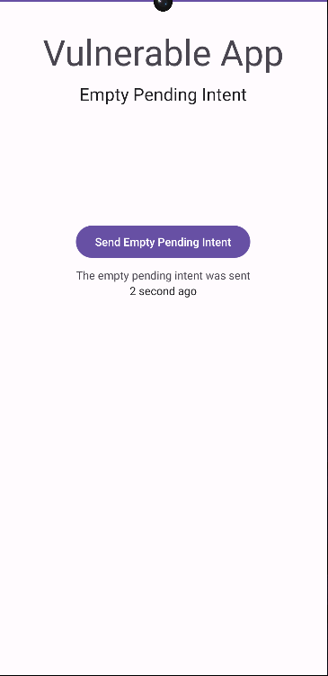
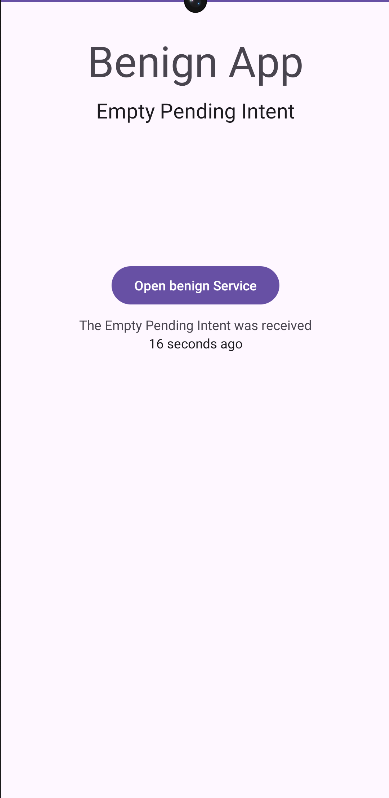

# **Empty Pending Intent**

This project demonstrate how using empty pending intent between applications could lead to privilege escalation attack.

## To know before reading
  A **PendingIntent** in Android is an object that encapsulates an Intent, allowing another application or component to execute that Intent on behalf of the original sender. A **PendingIntent** is commonly used in Android to delegate the execution of an Intent to another part of the system, enabling delayed or background execution of actions, such as starting an activity or broadcasting a message.

## Exploitation Scenario

Consider a vulnerable application called **vulnerable** who goal is to send a token so that another application **benign** can launch a specific service when it wants.

Upon the installation of the two applications, the user can open the **vulnerable** application and send a message to the **benign** application by pressing the corresponding button. The message contains an empty pending intent that will be used by the **benign** application to request a specific service.

When the user opens the **benign** application, a message has been displayed to him, the user can press the button to launch the benign service. The **vulnerable** app will now open to the benign activity screen.

However, on his phone another application called **malicious** is installed and launched. This application is capable of retrieving the message and the same way the **benign** app access the benign service, the **malicious** app can access the sensitive service throw the pending intent stored inside the message.

As a result, this scenario exemplifies a privilege escalation case where the **malicious** app gains access to sensitive service without the user's knowledge, presenting a security concern.

## API Levels

Tested on API Levels: 28-33
Will not work on API Levels greater than 33 because Android doesn't let you make an empty pending intent mutable.

## Running Scenario*

- Build & Run **vulnerable** app on a device.
    
    

- Build & Run **benign** app on a device.
    
    
    
- Open the **vulnerable** app and click on the send button.
    
    

- Open the **benign** app and click on the open button.

    

- The **vulnerable** open on the benign activity.
    
    

- Build & Run **malicious** app on a device.
    
    

- Open the **vulnerable** app press the back button on the device and click on the send button.
    
    

- Open the **vulnerable** app and click on the open button.

    

- The **vulnerable** open on the sensitive activity.
    
    

## Recommendations

  - To ensure the successful execution of the attack scenario, use one of the specified API levels mentioned above.
  - You can execute the app by building the open-source project using an IDE plugin (such as Android Studio) or by directly utilizing the APK files found in the 'apks' folder.

## Code Smells

This scenario is designed to highlight the importance to specify the action when you create a pending intent. The use of an empty pending intent by the vulnerable application allowed a malicious application to gain access to sensitive service. The code smell is located in the MainActivity.java file of the vulnerable application : 

```Java
    Bundle bundle = new Bundle();
    PendingIntent pi = PendingIntent.getService(getApplicationContext(), 0, emptyIntent, PendingIntent.FLAG_UPDATE_CURRENT | PendingIntent.FLAG_MUTABLE);

    bundle.putParcelable("pendingIntent", pi);
```

The use of a Mutable empty Pending intent let another application replace the intent with another one.

## References

[1]. https://developer.android.com/reference/android/app/PendingIntent

[2]. https://support.google.com/faqs/answer/10437428?hl=en
