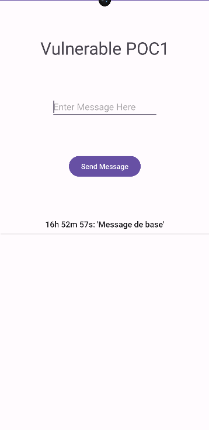

# **Empty Pending Intent**

Creating an implicite Intent and then getting a pending intent from it could lead to privilege escalation attack.

## To know before reading
  - A **PendingIntent** in Android is used to perform an action at a later time, often in a different context than the current activity. It's commonly used in scenarios like launching an activity from a notification, alarm manager, or sending broadcast intents.

## Exploitation Scenario

Consider a vulnerable application called **vulnerable** who goal is to send a message to another application called **receiver**.

Upon the installation of the two applications, the user can open the **vulnerable** application and send a message to the **receiver** application.

When the user opens the **receiver** application, a message has been displayed to him.

However, on his phone another application called **malicious** is installed. This application is capable of retrieving the message, modify his content and send this new message with all the permission the original message had.

As a result, this scenario exemplifies a privilege escalation case where the **malicious** app gains access to potentially sensitive permission without the user's explicit authorization, presenting a security concern.

## API Levels

Tested on API Levels: 28-33

## Running Scenario*

- Build & Run **malicious** app on an device.
    
    

- Build & Run **vulnerable** app on an device.
    
    
    
- Build & Run **receiver** app on an device.
    
    

- Open the **vulnerable** app and click on the send button.

    

- On the **malicious** app a message can be read.
    
    

- On the **receiver** app two message has arrived, one from the vulnerable, one from the malicious.
    
    

## Recommendations

  - To ensure the successful execution of the attack scenario, use one of the specified API levels mentioned above.
  - You can execute the apps by building the open-source project using an IDE plugin (such as Android Studio) or by direcrtly utilizing the APK files found in the 'apks' folder.

## References

[1]. https://developer.android.com/reference/android/app/PendingIntent

[2]. https://support.google.com/faqs/answer/10437428?hl=en
