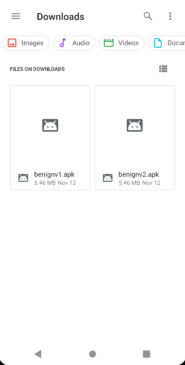
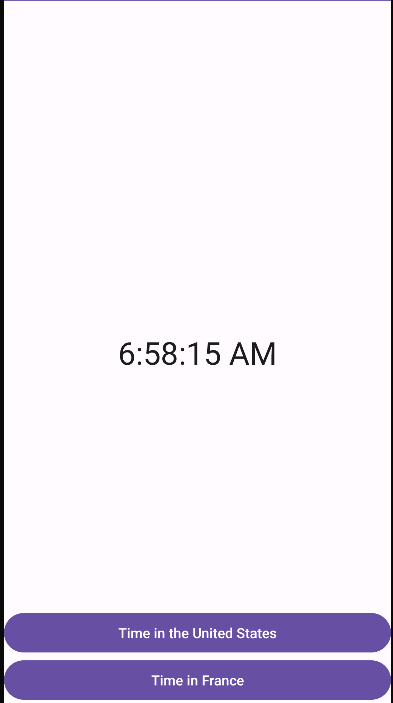
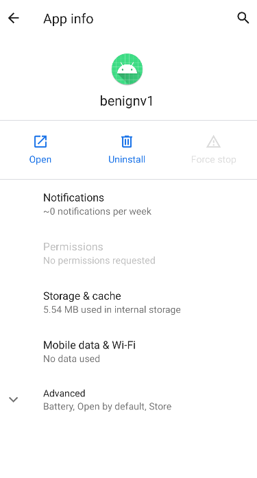
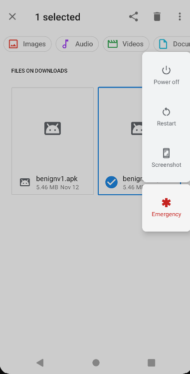
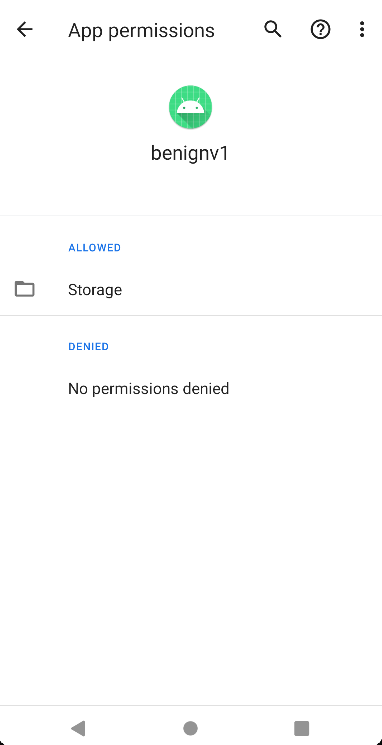

# Inconsistent-custom-permission-definition

Creating a custom permission with a `normal` dangerosity and updating it with a `dangerous` dangerosity can potentially result in a privilege escalation attack.

## Exploitation Scenario

Consider a benign application called benignv1 that initially use a `normal` custom permission.

Later, the app is updated by the developer, resulting in a new version called benignv2. In this update, the developer modifies the custom permission, changing its dangerosity to `dangerous` and adding it to the `storage` group. Additionnally, the developer requests the permission to read the phone storage, permission which also belongs to the `storage` group.
This group is onne of Android's standard permission categories which contains all `dangerous` permissions related to the storage of the phone.

However, upon downloading this updated app, an unexpected issue arises. After the restart of the phone, all permissions categorized under the "storage" group , including the custom permission and the permissionn to read the storage, are automatically accepted without requiring the user's explicit consent.

As a result, this scenario exemplifies a privilege escalation case where the app gains access to potentially sensitive permissions without the user's explicit authorization, presenting a security concern.

## API Levels

Tested on API Levels: 26, 27, 28, 29 and 30

## Running Scenario

- Build and add to the phone storage the .apk of the **v1** and the **v2** app
  

- Install and run **v1** app with the apk
  

- The app has no permission at the install
  

- Install **v2** with the apk and restart the phone
  

- All dangerous permissions belonging to the same group as the custom permission have been automatically granted to the benignv2 app without requesting the user's consent.
  

## References

[1]. https://cve.mitre.org/cgi-bin/cvename.cgi?name=CVE-2021-0317

[2]. Li, R., Diao, W., Li, Z., Du, J., & Guo, S. (2021, May). Android custom permissions demystified: From privilege escalation to design shortcomings. In 2021 IEEE Symposium on Security and Privacy (SP) (pp. 70-86). IEEE

[3]. https://sites.google.com/view/custom-permission
