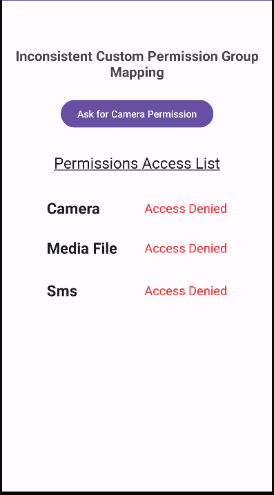
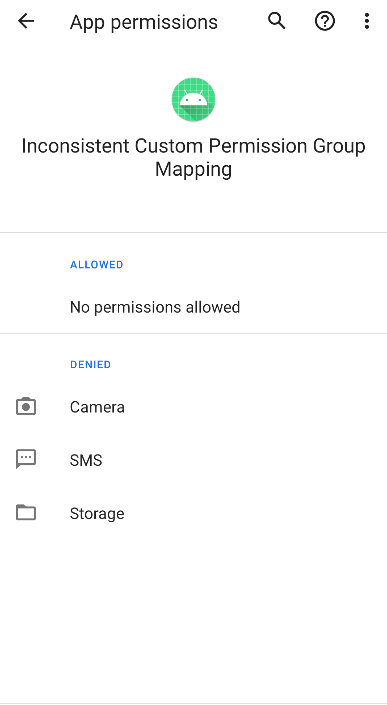
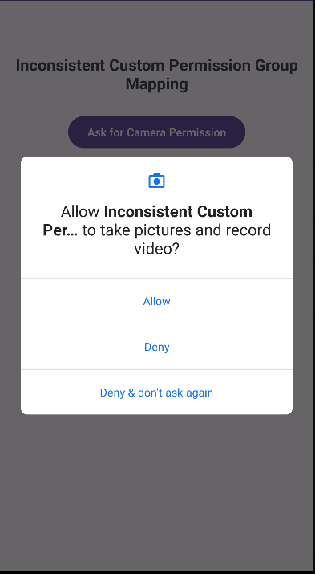
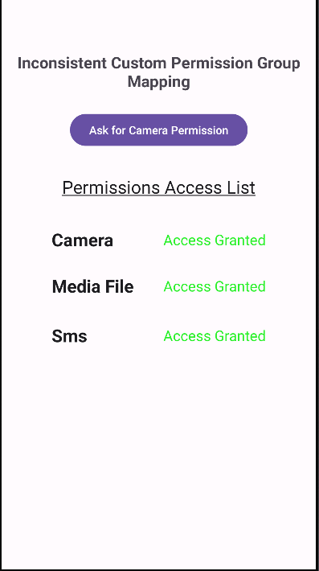

# **Inconsistent-custom-permission-group-mapping**

Creating a custom permission within an `UNDEFINED` group can potentially result in a privilege escalation attack.

## To know before reading

- A custom permission in Android is a developer-defined access control mechanism regulating specific app functionalities or components.

- Normal protection level enable access to designated resources without requiring explicit user consent at install-time whereas dangerous protection level enable access to designated resources but requires an explicit user consent at the first use.

- The granting of dangerous permissions is group-based in Android, .i.e. when an app requests a permission that belongs to a dangerous group, the user is prompted to grant the entire permission group rather than individual permissions within that group.

## Exploitation Scenario

Consider a benign application called **media** that initially requests several dangerous permissions, including access to the camera.

Upon installation, the user is prompted to grant or deny these permissions. Since the camera access is essential for the app's functionality, the user typically grants this permission.

Later, the app is updated by the developer, resulting in a new app containing the vulnerability that is calld **vulnerable**. In this update, the developer introduces a custom permission that falls under the UNDEFINED permission group. This group is designated for permissions that don't fit into any of Android's standard permission categories.

However, upon downloading this updated app, an unexpected issue arises. All permissions categorized under the "dangerous" group, including the camera access, are automatically accepted without requiring the user's explicit consent.

As a result, this scenario exemplifies a privilege escalation case where the app gains access to potentially sensitive permissions without the user's explicit authorization, presenting a security concern.

## API Levels

Tested on API level: 29

## Running Scenario

- Build & Run **media** app

  

- The **media** app has no permission granted at installation time.

  

- For instance, by clicking on the button, the user decide to grant only the camera permission

  

    

- The app has now the camera permission granted

- Now, Build & Run **vulnerable** app

  

- All dangerous permissions belonging to the same group as the camera permission have been automatically granted to the **benignv2** app without requesting the user's consent.
  

- This would not have been possible if the developer had not placed the custom permission in the 'UNDEFINED' permission group.

## Recommendations

- To ensure the successful execution of the scenario, use one of the specified API levels mentioned above.

- You can execute the apps by building the open-source project using an IDE plugin (such as Android Studio) or by directly utilizing the APK files found in the 'apks' folder.

## References

[1]. https://cve.mitre.org/cgi-bin/cvename.cgi?name=CVE-2020-0418

[2]. Li, R., Diao, W., Li, Z., Du, J., & Guo, S. (2021, May). Android custom permissions demystified: From privilege escalation to design shortcomings. In 2021 IEEE Symposium on Security and Privacy (SP) (pp. 70-86). IEEE

[3]. https://sites.google.com/view/custom-permission
