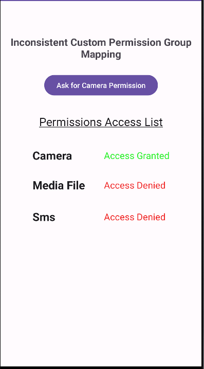
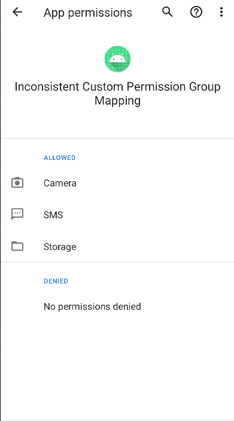

# **Inconsistent-custom-permission-group-mapping**

Creating a custom permission within an `UNDEFINED` group can potentially result in a privilege escalation attack.

## Exploitation Scenario

Consider a benign application called **benignv1** that initially requests several dangerous permissions, including access to the camera.

Upon installation, the user is prompted to grant or deny these permissions. Since the camera access is essential for the app's functionality, the user typically grants this permission.

Later, the app is updated by the developer, resulting in a new version called **benignv2**. In this update, the developer introduces a custom permission that falls under the UNDEFINED permission group. This group is designated for permissions that don't fit into any of Android's standard permission categories.

However, upon downloading this updated app, an unexpected issue arises. All permissions categorized under the "dangerous" group, including the camera access, are automatically accepted without requiring the user's explicit consent.

As a result, this scenario exemplifies a privilege escalation case where the app gains access to potentially sensitive permissions without the user's explicit authorization, presenting a security concern.

## API Levels

Tested on API Levels: 29

## Running Scenario

- Build & Run **v1** app
    
    
    
- **benignv1** app has no permission at installation.
    
    
    
- Click on the button and grant the Camera Permission
    
    
    
    
    
- The app has now the Camera Permission
- Build & Run **benignv2** app
    
    
    
- All dangerous permissions belonging to the same group as the camera permission have been automatically granted to the **benignv2** app without requesting the user's consent.
    
    
    

## References

[1]. https://cve.mitre.org/cgi-bin/cvename.cgi?name=CVE-2020-0418

[2]. Li, R., Diao, W., Li, Z., Du, J., & Guo, S. (2021, May). Android custom permissions demystified: From privilege escalation to design shortcomings. In 2021 IEEE Symposium on Security and Privacy (SP) (pp. 70-86). IEEE

[3]. https://sites.google.com/view/custom-permission