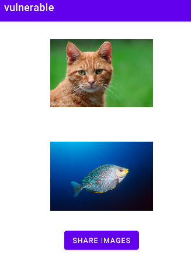
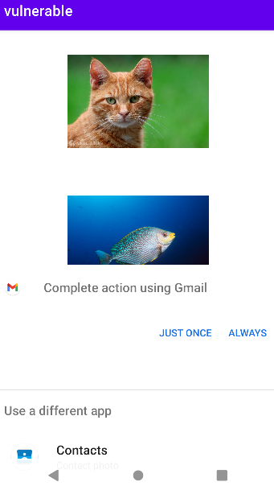

## PendingIntent - Array of Intents with Unset Actions - getActivities - Java
In this test case the **vulnerable** app creates a **PendingIntent** to display activities capable of receiving multiple images.




The following code snippet illustrates the utilization of an array containing intents lacking a specific action when employed with **getActivities()** within a **PendingIntent**


````java
Intent shareIntent = new Intent(); 
...
PendingIntent pendingIntent = PendingIntent.getActivities(
    this,
    0,
    new Intent[]{
        shareIntent},
    PendingIntent.FLAG_UPDATE_CURRENT
);
````

## References

[1]. https://developer.android.com/reference/android/app/PendingIntent

[2]. https://support.google.com/faqs/answer/10437428?hl=en
