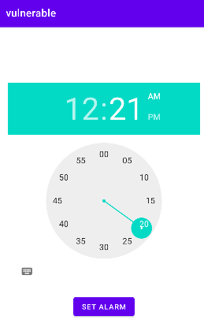

## PendingIntent - Unset Action - getBroadcast- Java
This app named **vulnerable** allows users to set an alarm using the TimePicker. When the alarm triggers, it displays a toast message via the AlarmReceiver. The PendingIntent used in setAlarm() method of MainActivity does not contain a specific action. 



This test case demonstrates how an intent with an unset action could present while using **PendingIntent.getRecevier(..)**.

````java
Intent alarmIntent = new Intent(MainActivity.this, AlarmReceiver.class);

PendingIntent alarmPendingIntent = PendingIntent.getBroadcast(MainActivity.this, 0, alarmIntent, PendingIntent.FLAG_IMMUTABLE);
````

## References

[1]. https://developer.android.com/reference/android/app/PendingIntent

[2]. https://support.google.com/faqs/answer/10437428?hl=en
