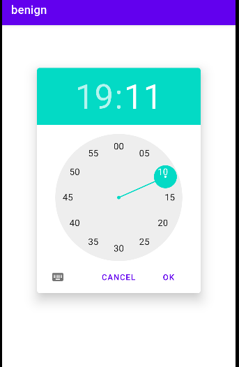

## PendingIntent - Benign app - Intent with a defined action - kotlin

In this test case the **benign** allows the user to set a reminder by specifying a time using a TimePickerDialog. When the specified time is reached, a notification is shown to remind the user. 




The benign app code is written in Kotlin, and it uses a PendingIntent with an action. The code below shows a pattern to define an intent action.

````kotlin
//Refer to MainActivity.kt for more details
val intent = Intent(this, ReminderBroadcastReceiver::class.java) 
intent.action = "com.example.reminder.ACTION_SHOW_NOTIFICATION"
val pendingIntent = PendingIntent.getBroadcast(
    this,
    0,
    intent,
    PendingIntent.FLAG_UPDATE_CURRENT
)
````

This app has been tested with Android version 10

## References

[1]. https://developer.android.com/reference/android/app/PendingIntent
