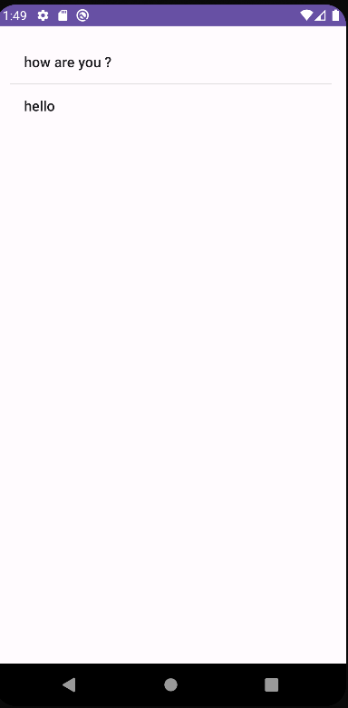

# Over-Privilege using reflection in Android Applications

This project demonstrates a critical security concern in Android applications: over-privilege with reflection. It showcases how apps can inadvertently request more permissions than needed and the potential exploitation of these permissions.

## Exploitation Scenario

The scenario involves three components:

- Benign App: Uses StringLibrary with reflection to reverse a string but mistakenly requests READ_SMS permission, without using the 2nd service.

- StringLibrary Module : Offers two services - reversing a string (no permission needed) and listing SMS titles (requires READ_SMS permission). This module is contained in the Benign application.

- Malicious App: Exploits the READ_SMS permission granted to the Benign App. This exploit enables the malicious app to read and display SMS messages.

The benign application implements a module which offers 2 services : reversing a string (no permission needed) and listing SMS titles (requires READ_SMS permission). The application does not uses the 2nd service but mistakenly asks for READ_SMS permission.
In this scenario, the application calls the first services using reflection.  
The malicious application then calls the service listing SMS titles using the content provider and the permission of the benign app. As a result, it can recover the SMS titles without asking for the user's consent.

## API Levels

Tested on API Levels: 23-29

## Running Scenario

- install and run **benign app**
  

- **benign** app ask one permission at installation.
  

- install and run **malicious app**
  

You should see that the sms of the user are displayed on the **malicious app** screen.

## Code Smells

This scenario is designed to highlight the importance of requesting only essential permissions.
The unessential permission requested by the benign application allowed a malicious application to gain access to sensitive data.

## References

[1]. https://www.baeldung.com/java-reflection

[2]. https://benhermann.eu/publications/hhl+17hardening.pdf
