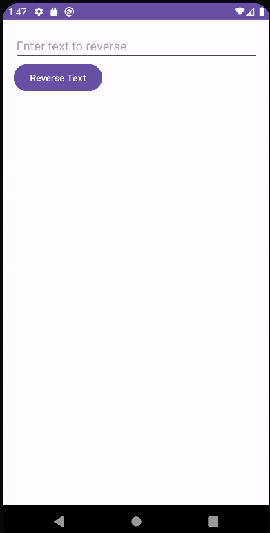
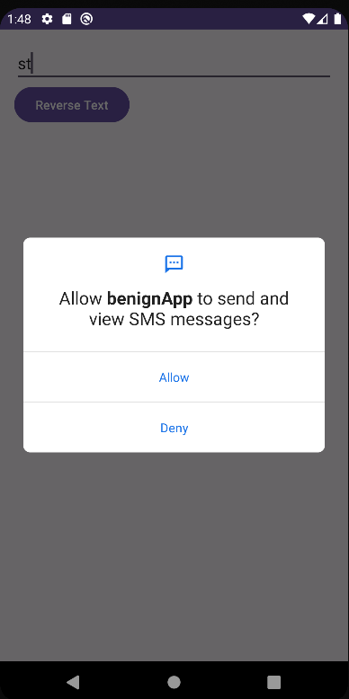
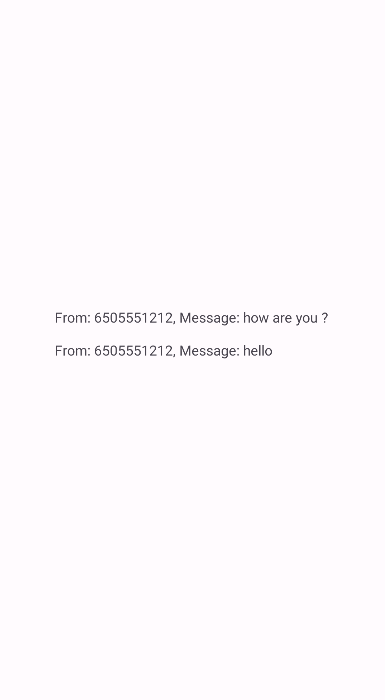

# Over-Privilege using reflection in Android Applications

This project demonstrates a critical security concern in Android applications: over-privilege. It showcases how apps can inadvertently request more permissions than needed and the potential exploitation of these permissions.

## To know before reading

- **uses-permission** enables the application to ask Android (and the user) to allow the application to do certain tasks. The end user is involved in authorizing those permissions. Example : permission READ_SMS.

- **uses-feature** enables the application to ask Android to authorize the run of some features on a hardware component. The user does not get involved. Example : the hardware component 'telephony'.  
  With its parameter `android:required`, it is possible for the application to say if this harware component is mandatory for the application to work properly.

## Exploitation Scenario

Consider a vulnerable application which contains a module with two services. This module can reverse a string (no permission needed) and list SMS titles (requires READ_SMS permission).  
The vulnerable application uses the service which reverses a string but does not use the service which lists SMS titles. However, the application mistakenly requests READ_SMS permission, which is not needed.

Later, a malicious application is downloaded on the same phone. This malicious application exploits the READ_SMS permission of the vulnerable application and runs the critical service of the module contained in the vulnerable application (which lists SMS titles). This exploit enables the malicious app to read and display SMS messages without resquesting the user's consent.

As a result, this scenario exemplifies an over-privilege case where the malicious app gain access to potentially sensitive data without the user's explicit authorization, presenting a security concern.

The scenario implementation thus involves three components:

- **StringLibrary Module** : Offers two services - reversing a string (no permission needed) and listing SMS titles (requires READ_SMS permission). This module is contained in the vulnerable application.

- **Vulnerable Application** : Uses the StringLibrary service which reverses a string. The application does not use the StringLibrary service which lists SMS titles, but mistakenly requests READ_SMS permission.

- **Malicious Application** : Runs the StringLibrary service which lists SMS titles. To run it, the malicious app exploits the READ_SMS permission mistakenly granted to the Vulnerable App.

## API Levels

The over privilege vulnerability has been successfully exploited in Android versions ranging from API level 24 to 30.

## Running Scenario

- install and run **vulnerable app**  
  

- **vulnerable** app ask one permission at installation, accept it  
  

- install and run **malicious app**  
  

You should see that the sms of the user are displayed on the **malicious app** screen.

## Code Smells

This scenario is designed to highlight the importance of requesting only essential permissions.
The unessential permission requested by the vulnerable application allowed a malicious application to gain access to sensitive data.
The code smell is located in the AndroidManifest.xml file of the vulnerable application :

```xml
<uses-permission android:name="android.permission.READ_SMS"/>
<uses-feature android:name="android.hardware.telephony" android:required="false" />

```

## References

[1]. https://www.baeldung.com/java-reflection

[2]. https://benhermann.eu/publications/hhl+17hardening.pdf
