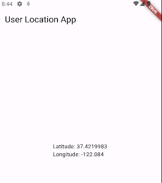

# Overprivileged Application - Invoking Location Api using Dart

In this case, the application **vulnerable** makes use of Dart programming language to call the Location API in order to capture the user position.




The code snippet below demonstrates how the app invokes the Location API using Dart Programming Language:

````dart
//See lib/main.dart for more details

import 'package:geolocator/geolocator.dart';
.
.
.
// Get current location
Position position = await Geolocator.getCurrentPosition(
        desiredAccuracy: LocationAccuracy.high);
.
.
setState(() {
      _currentPosition = position;
});
.
.
Text('Latitude: ${_currentPosition.latitude}\n
      Longitude: ${_currentPosition.longitude}')
````

For the proper functioning of this API call, the app requires the following permissions (refer to
AndroidManifest.xml):

 ````xml

<uses-permission android:name="android.permission.ACCESS_FINE_LOCATION" />
<uses-permission android:name="android.permission.ACCESS_COARSE_LOCATION">
 ````

However, the developer unintentionally included an unnecessary permission, *
*ACCESS_BACKGROUND_LOCATION**, introduced in Android 10, allowing access to the device's location
while the app operates in the background. The app, which should only access location data while in
the foreground, has no functionality or API calls that utilize this permission in its source code:

 ````xml
<uses-permission android:name="android.permission.ACCESS_BACKGROUND_LOCATION" />
 ````

This unnecessary permission might pose potential security risks, allowing the app to access location
in the background without a legitimate reason.


## API Level: 
  29 .. 34 (ACCESS_BACKGROUND_LOCATION is not recognized on Android versions before Android 10).

## References

[1]. https://developer.android.com/training/articles/perf-jni

[2]. https://developer.android.com/reference/android/location/LocationManager
