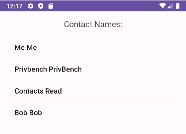

# Overprivileged Application - Invoking Contacts Api - Java

In this case, the application **vulnerable** makes use of Java to call the Contacts Provider API. 



The code snippet below demonstrates how the use of the service **query()** app invokes for reading contacts:

````java
ContentResolver contentResolver = getContentResolver();
Cursor cursor = contentResolver.query(
        ContactsContract.Contacts.CONTENT_URI,
        null,
        null,
        null,
        null
);
````

For the proper functioning of this API call, the app requires the following permissions (refer to *AndroidManifest.xml*):

 ````xml
<uses-permission android:name="android.permission.READ_CONTACTS" />
 ````

However, the developer mistakenly believed that accessing contacts required permission to access external storage. Consequently, they unintentionally included an unnecessary permission, READ_EXTERNAL_STORAGE, introduced in Android 16, which grants access to the device's storage (reading device files and folders).

 ````xml
<uses-permission android:name="android.permission.READ_EXTERNAL_STORAGE" android:maxSdkVersion="32"/>
 ````

This unnecessary permission might pose potential security risks, allowing the app to access device files and potentially exploit them harmfully without a legitimate reason for normal functioning.

## References

[1]. https://developer.android.com/guide/topics/providers/contacts-provider
