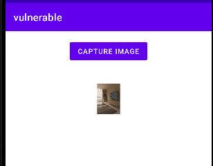
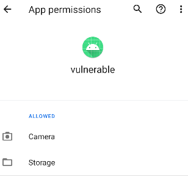

# Overprivileged Application - Invoke the Debuty camera app
In this test case, the app called **vulnerable** exemplifies an instance of excessive permission usage in Android applications. The primary objective of the **vulnerable** app is to utilize the default camera system app as a deputy to capture a photo and then display it.



The code below demonstrates how the vulnerable app triggers the default Camera app to capture an image via an Intent (MediaStore.ACTION_IMAGE_CAPTURE) without directly handling the camera operation.

````java
//Refer to MainActivity.java for more details

 private static final int REQUEST_IMAGE_CAPTURE = 101;
 .
 .
 Intent takePictureIntent = new Intent(MediaStore.ACTION_IMAGE_CAPTURE);
 .
 .
if (takePictureIntent.resolveActivity(getPackageManager()) != null) {
    startActivityForResult(takePictureIntent, REQUEST_IMAGE_CAPTURE);
}
````
To utilize the default camera app as a deputy, the vulnerable app doesn't inherently require the camera permission. However, the developers have explicitly included it in the manifest under the assumption that the vulnerable app captures images, thus necessitating this permission

 ````xml
<uses-permission android:name="android.permission.CAMERA"/> <!--unnecessary permission-->
<uses-permission android:name="android.permission.READ_EXTERNAL_STORAGE" />
 ````
As a result, the user also granted this permission to the app as it manages photo captures.

 

  This unnecessary permission might lead to potential security risks and may grant the app access to reading the user contacts without a legitimate reason.


## API Levels: 
This app has been tested on Android 10 (Api level 29)