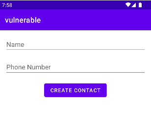

# Overprivileged Application - Invoking Contacts Provider Api through Kotlin Reflection

In this case, the **vulnerable** app allows users to create new contacts.



It makes use of the **java.lang.reflect** package in Kotlin programming language to access the Contacts API. The following code snippet illustrates how the app utilizes reflection to invoke the Contacts API:

````kotlin
val resolver: ContentResolver = contentResolver

val insertMethod: Method = resolver.javaClass.getMethod(
    "insert",
    Uri::class.java, ContentValues::class.java
)

val contactUri: Uri? = insertMethod.invoke(resolver, rawContactsUri, contentValues) as Uri?
...
val insertDataMethod: Method = resolver.javaClass.getMethod(
   "insert",
   Uri::class.java, ContentValues::class.java
)

insertDataMethod.invoke(resolver, ContactsContract.Data.CONTENT_URI, dataNameValues)
insertDataMethod.invoke(resolver, ContactsContract.Data.CONTENT_URI, dataPhoneValues)
````

As the app is exclusively used for adding new contacts, it only requires the following permission (refer to AndroidManifest.xml):

 ````xml
<uses-permission android:name="android.permission.WRITE_CONTACTS" />
 ````
However, the developer additionally declared an unnecessary permission, allowing the app to read the user's contacts.

````xml
<uses-permission android:name="android.permission.READ_CONTACTS" />
````
 
 This unnecessary permission might lead to potential security risks and may grant the app access to reading the user contacts without a legitimate reason.


 ## References
  [1]. https://medium.com/@amoljp19/mastering-kotlin-reflection-bce2a561a467

  [2]. https://developer.android.com/guide/topics/providers/contacts-provider
