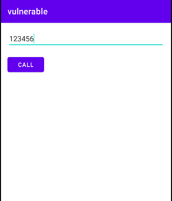

# Overprivileged App - Java Reflection - Class.forname() Pattern - Hardening String Parameter

In this case, the **vulnerable** app allows users to make phone calls




It makes use of the java reflection technique to access Intent.ACTION_CALL API. The following code snippet illustrates how the app utilizes reflection to realize this:

````java
//More implementation details can be found in MainActivity.java
private static final String INTENT_CLASS_NAME = "android.content.Intent";
private static final String ACTION_CALL_FIELD = "ACTION_CALL";
.
.
Class<?> c = Class.forName(INTENT_CLASS_NAME);
Intent intent = new Intent((String) c.getField(ACTION_CALL_FIELD).get(null));
.
.
startActivity(intent);
````

This only requires the following permission:

 ````xml
<uses-permission android:name="android.permission.CALL_PHONE"/>
 ````
However, the developer additionally declared two unnecessary permissions

````xml
<uses-permission android:name="android.permission.WRITE_CALL_LOG"/>
<uses-permission android:name="android.permission.READ_CALL_LOG"/>
````
 
## References
[1]. https://www.tutorialspoint.com/java/lang/class_forname_loader.htm

