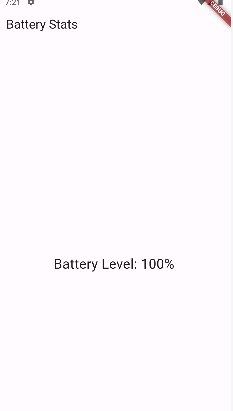

# Overprivileged Application - Manipulating Batterie using Dart

In this case, the application **vulnerable** makes use of Dart programming language to display statistics related to the device batterie




The code snippet below demonstrates how the app invokes the Batterie API using Dart Programming Language:

````dart
//See lib/main.dart for more details
import 'package:battery/battery.dart';
.
.
Battery _battery = Battery();
final int batteryLevel = await _battery.batteryLevel;
````
No permission is required for the app to function correctly. However, the developer mistakenly declared the BATTERY_STATS permission in the Manifest file. This permission is used internally by the Android SDK, and there's no need for developers to declare it explicitly in their Manifest files.

 ````xml
<uses-permission android:name="android.permission.BATTERY_STATS"/>
````

## API Level: 
This app has been tested with API Level 29 (Android version 9)


## References
[1]. https://developer.android.com/reference/android/Manifest.permission#BATTERY_STATS, last visit: 24/02/2024
[2]. https://stackoverflow.com/questions/8225926/android-permission-battery-stats-usage
