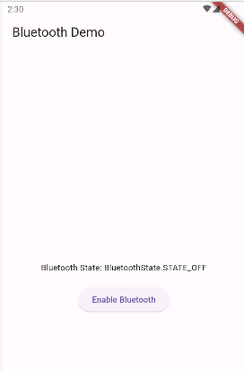
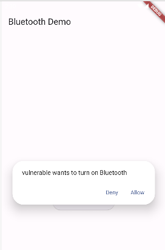
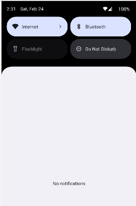

# Overprivileged Application - Invoking Bluetooth Api using Dart

In this case, the application **benign** makes use of Dart programming language to manipulate the Bluetooth API in order to enable and disable the bluetooth connectivity programatacally. The results of the app running is demonstrated through the follwing captures 



Once we click to "Enable Bluetooth" Button, the permission "BLUETOOTH_CONNECT" is requested



The state of the app is changed


The bluetooth status of the device is ON




The code snippet below demonstrates how the app invokes the Contacts API using Dart Programming Language:

````dart
//See lib/main.dart for more details
import 'package:flutter_bluetooth_serial/flutter_bluetooth_serial.dart'
.
.
//Permiisions Request
Map<Permission, PermissionStatus> permissions = await [
  Permission.bluetooth,
  Permission.bluetoothConnect,
].request();
.
.
// Request to enable Bluetooth
await FlutterBluetoothSerial.instance.requestEnable();
.
.
//Request to disable Bluetooth
await FlutterBluetoothSerial.instance.requestDisable();
````

For the proper functioning of this API call, the app requires the following permissions [1] (refer to
AndroidManifest.xml):

 ````xml
<uses-permission android:name="android.permission.BLUETOOTH"/>
<uses-permission android:name="android.permission.BLUETOOTH_ADMIN"/>
<uses-permission android:name="android.permission.BLUETOOTH_CONNECT" />
````

## Important Information: 
 The permission "BLUETOOTH_CONNECT" is known only for Android 12 or higher


## API Level: 
This app has been tested with API Level 34 (Android version 14)


## References
[1]. https://developer.android.com/develop/connectivity/bluetooth/bt-permissions#declare-android12-or-higher, last visit: 24/02/2024
