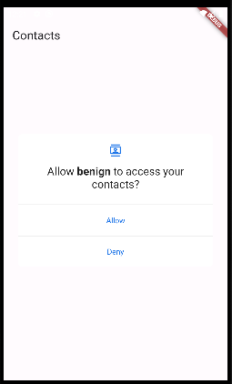

# Overprivileged Application - Invoking Location Api using Dart

In this case, the application **benign** makes use of Dart programming language to call the Contacts API in order to display the list of saved contacts.




The code snippet below demonstrates how the app invokes the Contacts API using Dart Programming Language:

````dart
//See lib/main.dart for more details
import 'package:contacts_service/contacts_service.dart';
.
.
.
//Getting the list of Contacts
Iterable<Contact> contacts =
    await ContactsService.getContacts(withThumbnails: false);
setState(() {
  _contacts = contacts.toList();
});
````

For the proper functioning of this API call, the app requires the following permission [1] (refer to
AndroidManifest.xml):

 ````xml
<uses-permission android:name="android.permission.READ_CONTACTS" />
 ````


## API Level: 
  This app has been tested with API Level 29 (Android version 10)

## References

[1]. https://developer.android.com/training/contacts-provider/retrieve-names
