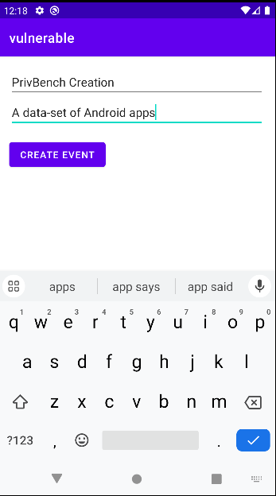
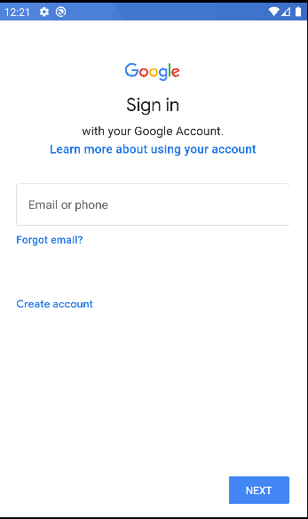

# Overprivileged Application - Invoke the Deputy Calendar app
In this test case, the app called **vulnerable** exemplifies an instance of excessive permission usage in Android applications. The primary objective of the **vulnerable** app is to utilize the default Calendar system app as a deputy to create calendar events.

 

The code below demonstrates how the vulnerable app triggers the default **Calendar** app to create an event via an Intent.

````java
//Refer to MainActivity.java for more details
 .
 .
// Create calendar event intent
 Intent intent = new Intent(Intent.ACTION_INSERT)
      .setData(CalendarContract.Events.CONTENT_URI)
      .putExtra(CalendarContract.Events.TITLE, title)
      .putExtra(CalendarContract.Events.DESCRIPTION, description);
 .
 .
 // Verify that there's at least one app available to handle the intent
  if (intent.resolveActivity(getPackageManager()) != null) {
    // Start the activity (create calendar event)
    startActivity(intent);
  }
````
To use the default calendar app as a deputy, the vulnerable app doesn't inherently require the **READ_CALENDAR** and **WRITE_CALENDAR** permissions. However, the developer have explicitly included it in the manifest under the assumption that the vulnerable app create a caledar events, thus necessitating these permissions

 ````xml
<uses-permission android:name="android.permission.READ_CALENDAR" />
<uses-permission android:name="android.permission.WRITE_CALENDAR"/>
 ```` 

These unnecessary permissions might lead to a privilege escalation attack.


## API Levels: 
This app has been tested on Android 10 (Api level 29)