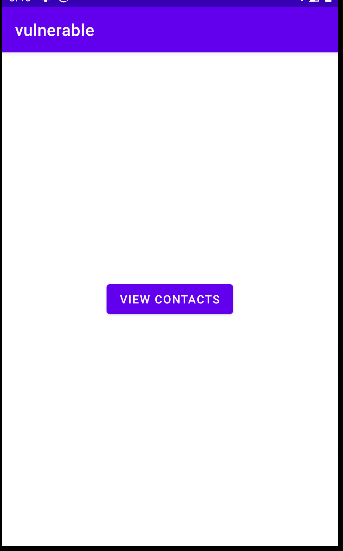
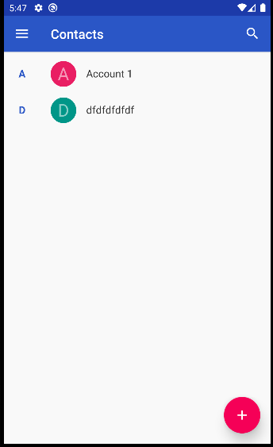

# Overprivileged Application - Invoke the Deputy Contacts app
In this test case, the app called **vulnerable** demonstrates an instance of excessive permission usage in Android applications. The goal of the **vulnerable** app is to use the default contacts system app as a **deputy** to display the user contacts.



The code below demonstrates how the vulnerable app triggers the default Contacts app to displays the user cotacts via an Intent.

````java
//Refer to MainActivity.java for more details

Intent intent = new Intent(Intent.ACTION_VIEW);
.
.        
// Set the data (URI) for the intent to view contacts
intent.setData(ContactsContract.Contacts.CONTENT_URI); 

// Set the data (URL) for the intent
intent.setData(Uri.parse(url));      
  
if (intent.resolveActivity(getPackageManager()) != null) {
  // Start the activity (open the contacts app)
  startActivity(intent);
} 
````
To use the default **Contacts** app as a deputy, the vulnerable app doesn't inherently require the **READ_CONTACTS** permission. However, the developers have explicitly included it in the manifest under the assumption that the vulnerable app reads the **Contacts**, thus necessitating this permission

 ````xml
<uses-permission android:name="android.permission.READ_CONTACTS" />
 ````

This unnecessary permission might lead to potential security risks and may grant the app access to read contacts without a legitimate reason.

## API Levels: 
This app has been tested on Android 10 (Api level 29)
