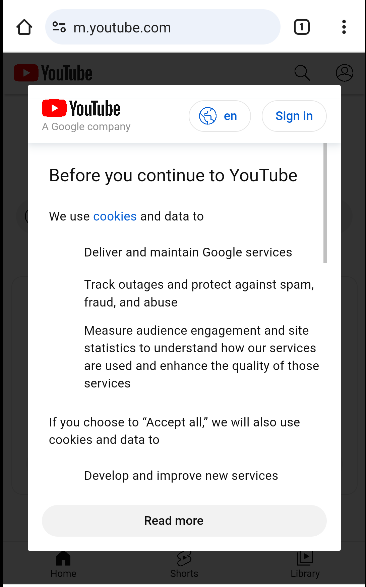

# Overprivileged Application - Invoke the Debuty browser app
In this test case, the app called **vulnerable** demonstrates an instance of excessive permission usage in Android applications. The goal of the **vulnerable** app is to use the default browser system app as a **deputy** to navigate to a user entered url.



The code below demonstrates how the vulnerable app triggers the default Browser app and navigate into the url via an Intent.

````java
//Refer to MainActivity.java for more details

// 1. Retrieve the URL from the EditText field
String url = urlEditText.getText().toString().trim();

// 2. Create an intent with the ACTION_VIEW action
  Intent intent = new Intent(Intent.ACTION_VIEW);

// 3. Explicitly set the package name of the browser app
intent.setPackage("com.android.chrome"); 

// Set the data (URL) for the intent
intent.setData(Uri.parse(url));      
  
if (intent.resolveActivity(getPackageManager()) != null) {
  // Start the activity (open the browser)
  startActivity(intent);
} 
````
To use the default browser app as a deputy, the vulnerable app doesn't inherently require the Internet permission. However, the developers have explicitly included it in the manifest under the assumption that the vulnerable app manipuates **Uri**, thus necessitating this permission

 ````xml
<uses-permission android:name="android.permission.INTERNET" />
 ````

This unnecessary permission might lead to potential security risks and may grant the app access to send sensitive data via internet without a legitimate reason.

## API Levels: 
This app has been tested on Android 10 (Api level 29)
