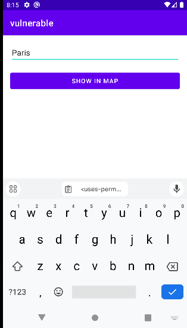

# Overprivileged Application - Invoke the Deputy Google Maps app
In this test case, the app called **vulnerable** demonstrates an instance of excessive permission usage in Android applications. The goal of the **vulnerable** app is to use the default **Maps** system app as a **deputy** to display a given location.



The code below demonstrates how the vulnerable app triggers the default **Maps** app to display the given location

````kotlin
//Refer to MainActivity.kt for more details

val mapUri = Uri.parse("geo:0,0?q=$location")
        
val mapIntent = Intent(Intent.ACTION_VIEW, mapUri)
        
mapIntent.setPackage("com.google.android.apps.maps")
        
if (mapIntent.resolveActivity(packageManager) != null) {
  // Start the activity (open Google Maps)
  startActivity(mapIntent)
} 
````
To use the default **Maps** app as a deputy, the vulnerable app doesn't inherently require the *ACCESS_FINE_LOCATION** and **ACCESS_COARSE_LOCATION** permissions. However, the developers have explicitly included it in the manifest under the assumption that the vulnerable app maipulate the location, thus necessitating these permissions

 ````xml
<uses-permission android:name="android.permission.ACCESS_FINE_LOCATION" />
<uses-permission android:name="android.permission.ACCESS_COARSE_LOCATION"/> 
````

These unnecessary permissions might lead to potential security risks related to Privilege Escalation.

## API Levels: 
This app has been tested on Android 10 (Api level 29)
