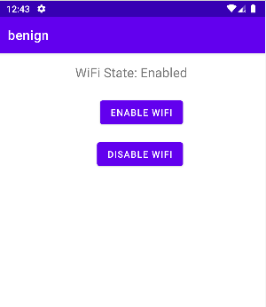
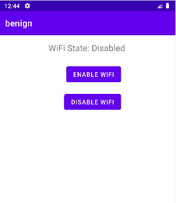

# The use of the WifiManager
In this test case, the app called **benign** access information about Wi-Fi networks, and has the ability to change the Wi-Fi connectivity state



The code below demonstrates how the benign app triggers =
````kotlin
//Refer to MainActivity.kt for more details

//Get a reference of WifiManage
val wifiManager = applicationContext.getSystemService(Context.WIFI_SERVICE) 

//Enable Wifi
wifiManager.isWifiEnabled = true 

//Disable Wifi
wifiManager.isWifiEnabled = false

````

For the app to be able to access wifi status and change it, it has to declare the following permissions

 ````xml
 <uses-permission android:name="android.permission.CHANGE_WIFI_STATE" />
<uses-permission android:name="android.permission.ACCESS_WIFI_STATE" />
````


## API Levels: 
This app has been tested on Android 9 (Api level 28)

## References
[1]. https://developer.android.com/reference/android/net/wifi/WifiManager

[2]. https://developer.android.com/reference/android/Manifest.permission#ACCESS_WIFI_STATE

[3]. https://developer.android.com/reference/android/Manifest.permission#CHANGE_WIFI_STATE
