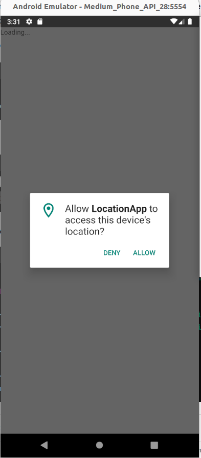
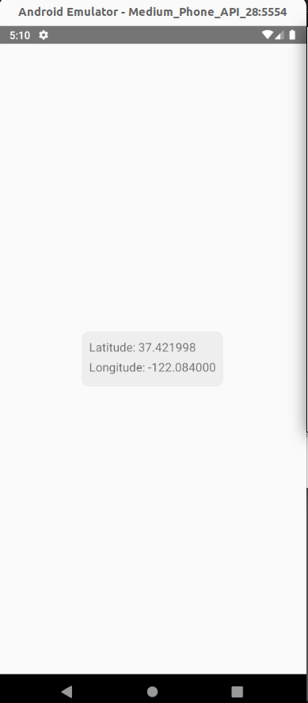

# Benign Application - Invoking Location API Using TypeScript with React-Native Framework

In this case, the application **benign** makes use of React-Native using type script to call the location API. The app displays the user current position into the screen. 

 


The code snippet below demonstrates how the app invokes the Location API through TypeScript:
````typescript
// Refer to the file App.tsx for more details
  useEffect(() => {
    Geolocation.getCurrentPosition(
      position => {
        const { latitude, longitude } = position.coords;
        setLocation({ latitude, longitude });
      },
      error => alert(error.message),
      { enableHighAccuracy: true, timeout: 20000, maximumAge: 1000 }
    );

````

For the proper functioning of this API call, the app requires the following permissions (refer to AndroidManifest.xml for more details):

````xml
<uses-permission android:name="android.permission.ACCESS_FINE_LOCATION" />
<uses-permission android:name="android.permission.ACCESS_COARSE_LOCATION" /> 
````


## References

[1]. https://developer.android.com/develop/sensors-and-location/location/permissions
